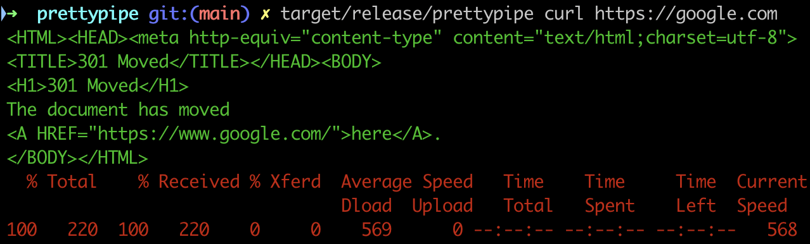

# PrettyPipe

Does one thing, and does it ~well~ poorly.

It will run a command for you and print its stdout and stderr in different colours (green and red).



## Installation

Only works on \*nixes - tested on macOS and Ubuntu.

Releases are available from GitHub's release tab, or to build it yourself:

```
$ cargo build --release
$ cp target/release/prettypipe /path/to/some/folder/on/your/PATH
```
